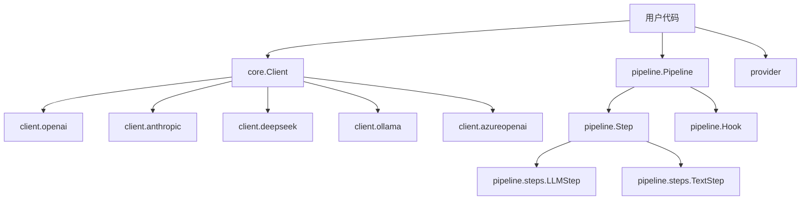

# GoChat Code Wiki

## 1. 项目概述

GoChat是一个现代化、企业级的Go语言客户端SDK，用于与大型语言模型(LLMs)交互。它提供了一个优雅且类型安全的统一接口，完全平滑了OpenAI、Anthropic (Claude)、DeepSeek、Qwen、Ollama等主要云提供商或本地模型之间的API差异。

### 核心特性

- **统一接口**：提供一致的API接口，屏蔽不同LLM提供商的差异
- **统一工具调用**：定义一次工具，自动转换为对应提供商的工具调用格式
- **内置抗脆弱机制**：自动捕获HTTP 429速率限制和网络波动，触发指数退避和抖动重试
- **本地向量化**：基于轻量级ONNX运行时直接在本地计算嵌入，无需部署庞大的Ollama服务
- **工作流编排**：通过Pipeline优雅地组织复杂的RAG或Agent推理流程
- **强类型上下文传递**：利用Go 1.24+泛型，在步骤间无缝传递自定义强类型结构体

## 2. 项目架构

GoChat采用模块化的架构设计，将不同功能分离到独立的包中，实现了高度的可扩展性和可维护性。

### 整体架构

```
gochat/
├── client/         # 各LLM提供商的客户端实现
│   ├── anthropic/  # Anthropic (Claude)客户端
│   ├── azureopenai/ # Azure OpenAI客户端
│   ├── deepseek/   # DeepSeek客户端
│   ├── ollama/     # Ollama本地模型客户端
│   └── openai/     # OpenAI客户端
├── core/           # 核心接口和通用功能
├── pipeline/       # 工作流编排功能
├── provider/       # 额外的提供商实现
├── docs/           # 文档
└── examples/       # 示例代码
```

### 模块依赖关系



## 3. 核心模块

### 3.1 Core模块

Core模块定义了GoChat的核心接口和通用功能，是整个库的基础。

#### 核心接口

- **Client**：与LLM交互的主要接口，所有提供商都实现了此接口
  - `Chat(ctx context.Context, messages []Message, opts ...Option) (*Response, error)`：发送消息并返回完整响应
  - `ChatStream(ctx context.Context, messages []Message, opts ...Option) (*Stream, error)`：发送消息并返回事件流

#### 关键数据结构

- **Message**：表示对话中的一条消息
  - 包含角色(Role)、内容(Content)、工具调用(ToolCalls)等字段
  - 支持多种内容类型：文本、图像、文件等

- **ContentBlock**：消息中的内容块
  - 支持文本、图像、文件等多种类型

- **Stream**：流式响应的处理
  - 提供Next()方法遍历事件
  - 支持内容、思考、错误等事件类型

#### 功能特性

- **Options模式**：通过函数选项模式实现灵活的配置
- **重试机制**：自动处理网络错误和速率限制
- **工具调用**：统一的工具调用接口
- **附件处理**：支持图像和文件等附件

### 3.2 Client模块

Client模块包含了各个LLM提供商的具体实现，它们都实现了Core模块定义的Client接口。

#### 支持的提供商

- **OpenAI**：支持GPT-4o、o1、o3-mini等模型
- **Anthropic**：支持Claude 3.5/3.7等模型
- **DeepSeek**：支持V3、R1等模型
- **Alibaba Qwen**：支持通义千问系列模型
- **Google Gemini**：支持1.5 Pro/Flash等模型
- **Ollama**：支持本地部署的模型
- **Azure OpenAI**：支持Microsoft部署的模型

#### 实现特点

- 每个提供商都有自己的客户端实现
- 处理各自API的特性和差异
- 统一转换为Core模块的接口和数据结构
- 支持流式和非流式调用

### 3.3 Pipeline模块

Pipeline模块提供了工作流编排功能，允许用户将独立的步骤组合成复杂的流程。

#### 核心组件

- **Pipeline**：管理一系列按顺序执行的步骤
  - 支持添加步骤和钩子
  - 提供执行方法

- **Step**：流水线中的单个步骤
  - 定义了Execute方法
  - 可以是任意实现了Step接口的类型

- **Hook**：用于观察流水线执行的钩子
  - 支持在步骤开始、完成和错误时触发

#### 内置步骤

- **LLMStep**：与LLM交互的步骤
- **TextStep**：文本处理步骤
- **TemplateStep**：模板渲染步骤

#### 控制流

- **IfStep**：条件执行步骤
- **LoopStep**：循环执行步骤

### 3.4 Provider模块

Provider模块包含了一些额外的提供商实现，如Gemini、Minimax和Qwen等。

## 4. 关键类与函数

### 4.1 Core模块

#### Client接口

```go
type Client interface {
    Chat(ctx context.Context, messages []Message, opts ...Option) (*Response, error)
    ChatStream(ctx context.Context, messages []Message, opts ...Option) (*Stream, error)
}
```

- **参数**：
  - `ctx`：上下文，用于取消和超时
  - `messages`：对话消息
  - `opts`：可选参数（温度、最大令牌数、工具等）

- **返回值**：
  - `Chat`：返回完整响应和错误
  - `ChatStream`：返回事件流和错误

#### Message相关函数

- **NewUserMessage(text string) Message**：创建用户消息
- **NewSystemMessage(text string) Message**：创建系统消息
- **NewTextMessage(role, text string) Message**：创建文本消息

#### Option相关函数

- **WithTemperature(t float64) Option**：设置温度
- **WithMaxTokens(t int) Option**：设置最大令牌数
- **WithTools(tools []Tool) Option**：设置工具
- **WithThinking(level int) Option**：启用思考模式

### 4.2 Client模块

#### OpenAI客户端

```go
func NewOpenAI(config core.Config) (*Client, error)
```

- **参数**：
  - `config`：包含API密钥、模型名称、基础URL等配置

- **返回值**：
  - OpenAI客户端实例和错误

#### Anthropic客户端

```go
func NewAnthropic(config core.Config) (*Client, error)
```

- **参数**：
  - `config`：包含API密钥、模型名称等配置

- **返回值**：
  - Anthropic客户端实例和错误

### 4.3 Pipeline模块

#### Pipeline相关函数

```go
func New[T any]() *Pipeline[T]
func (p *Pipeline[T]) AddStep(step Step[T]) *Pipeline[T]
func (p *Pipeline[T]) Execute(ctx context.Context, state T) error
```

- **参数**：
  - `step`：要添加的步骤
  - `ctx`：上下文，用于取消
  - `state`：传递给每个步骤的状态对象

- **返回值**：
  - `New`：返回新的Pipeline实例
  - `AddStep`：返回Pipeline实例，用于方法链
  - `Execute`：返回执行错误

#### Step相关函数

```go
func NewTemplateStep(template, outputKey, inputKeys ...string) Step[*State]
func NewGenerateCompletionStep(client core.Client, inputKey, outputKey, model string) Step[*State]
```

- **参数**：
  - `template`：模板字符串
  - `outputKey`：输出键
  - `inputKeys`：输入键
  - `client`：LLM客户端
  - `model`：模型名称

- **返回值**：
  - Step实例

## 5. 依赖关系

GoChat的主要依赖如下：

| 依赖项 | 用途 | 来源 |
|-------|------|------|
| Go 1.24+ | 基础语言环境，支持泛型 | [golang.org](https://golang.org/) |
| net/http | HTTP客户端 | 标准库 |
| encoding/json | JSON序列化与反序列化 | 标准库 |
| context | 上下文管理 | 标准库 |
| github.com/onnxruntime/onnxruntime-go | ONNX运行时，用于本地嵌入 | [GitHub](https://github.com/onnxruntime/onnxruntime-go) |

## 6. 项目运行方式

### 6.1 安装

```bash
go get github.com/DotNetAge/gochat
```

### 6.2 基本使用

#### 1. 创建客户端

```go
import (
    "github.com/DotNetAge/gochat/core"
    "github.com/DotNetAge/gochat/client/openai"
)

// 创建OpenAI客户端
client, err := openai.NewOpenAI(core.Config{
    APIKey: "your-api-key",
    Model:  "gpt-4o",
})
if err != nil {
    log.Fatal(err)
}
```

#### 2. 发送消息

```go
import "github.com/DotNetAge/gochat/core"

// 创建消息
messages := []core.Message{
    core.NewSystemMessage("You are a helpful assistant."),
    core.NewUserMessage("Hello, who are you?"),
}

// 发送消息
response, err := client.Chat(ctx, messages)
if err != nil {
    log.Fatal(err)
}

fmt.Println(response.Content)
```

#### 3. 流式响应

```go
// 发送流式请求
stream, err := client.ChatStream(ctx, messages)
if err != nil {
    log.Fatal(err)
}
defer stream.Close()

// 处理流式响应
for stream.Next() {
    event := stream.Event()
    fmt.Print(event.Content)
}

if err := stream.Err(); err != nil {
    log.Fatal(err)
}
```

#### 4. 使用Pipeline

```go
import (
    "github.com/DotNetAge/gochat/pipeline"
    "github.com/DotNetAge/gochat/pipeline/steps"
)

// 创建Pipeline
p := pipeline.New[*pipeline.State]().
    AddStep(steps.NewTemplateStep("User question: {{.query}}", "prompt", "query")).
    AddStep(steps.NewGenerateCompletionStep(client, "prompt", "answer", "gpt-4o"))

// 创建状态
state := pipeline.NewState()
state.Set("query", "What is GoChat?")

// 执行Pipeline
err := p.Execute(ctx, state)
if err != nil {
    log.Fatal(err)
}

fmt.Println(state.GetString("answer"))
```

### 6.3 本地嵌入

```go
import "github.com/DotNetAge/gochat/pkg/embedding"

// 创建本地嵌入提供商
provider, err := embedding.WithBEG("bge-small-zh-v1.5", "")
if err != nil {
    log.Fatal(err)
}

// 生成嵌入
texts := []string{"Hello world", "你好世界"}
embeddings, err := provider.Embed(ctx, texts)
if err != nil {
    log.Fatal(err)
}

// 获取向量维度
dim := provider.Dimension()
fmt.Printf("Vector dimension: %d\n", dim)
```

## 7. 示例代码

GoChat提供了丰富的示例代码，位于`examples/`目录中：

| 示例 | 功能 | 路径 |
|------|------|------|
| 01_basic_chat | 基本聊天功能 | [examples/01_basic_chat/main.go](file:///Users/ray/workspaces/ai-ecosystem/gochat/examples/01_basic_chat/main.go) |
| 02_multi_turn | 多轮对话 | [examples/02_multi_turn/main.go](file:///Users/ray/workspaces/ai-ecosystem/gochat/examples/02_multi_turn/main.go) |
| 03_streaming | 流式响应 | [examples/03_streaming/main.go](file:///Users/ray/workspaces/ai-ecosystem/gochat/examples/03_streaming/main.go) |
| 04_tool_calling | 工具调用 | [examples/04_tool_calling/main.go](file:///Users/ray/workspaces/ai-ecosystem/gochat/examples/04_tool_calling/main.go) |
| 05_multiple_providers | 多提供商 | [examples/05_multiple_providers/main.go](file:///Users/ray/workspaces/ai-ecosystem/gochat/examples/05_multiple_providers/main.go) |
| 06_image_input | 图像输入 | [examples/06_image_input/main.go](file:///Users/ray/workspaces/ai-ecosystem/gochat/examples/06_image_input/main.go) |
| 07_document_analysis | 文档分析 | [examples/07_document_analysis/main.go](file:///Users/ray/workspaces/ai-ecosystem/gochat/examples/07_document_analysis/main.go) |
| 08_multiple_images | 多图像输入 | [examples/08_multiple_images/main.go](file:///Users/ray/workspaces/ai-ecosystem/gochat/examples/08_multiple_images/main.go) |
| 09_helper_utilities | 辅助工具 | [examples/09_helper_utilities/main.go](file:///Users/ray/workspaces/ai-ecosystem/gochat/examples/09_helper_utilities/main.go) |

## 8. 配置与部署

### 8.1 配置选项

GoChat的配置主要通过`core.Config`结构体进行：

```go
type Config struct {
    APIKey     string            // API密钥
    AuthToken  string            // 认证令牌
    Model      string            // 模型名称
    BaseURL    string            // API基础URL
    HTTPClient *http.Client      // 自定义HTTP客户端
    Headers    map[string]string // 自定义HTTP头
}
```

### 8.2 环境变量

GoChat支持从环境变量中读取配置：

- `GOCHAT_API_KEY`：API密钥
- `GOCHAT_MODEL`：默认模型名称
- `GOCHAT_BASE_URL`：API基础URL

### 8.3 部署建议

- **生产环境**：建议使用环境变量存储API密钥，避免硬编码
- **高并发场景**：建议使用自定义HTTP客户端，配置合理的超时和连接池
- **容错处理**：建议实现重试机制和错误处理，提高系统稳定性

## 9. 监控与维护

### 9.1 日志

GoChat通过Pipeline的Hook机制支持日志记录：

```go
// 实现Hook接口
type LoggerHook struct{}

func (h *LoggerHook) OnStepStart(ctx context.Context, step pipeline.Step[*pipeline.State], state *pipeline.State) {
    fmt.Printf("Step %s started\n", step.Name())
}

func (h *LoggerHook) OnStepComplete(ctx context.Context, step pipeline.Step[*pipeline.State], state *pipeline.State) {
    fmt.Printf("Step %s completed\n", step.Name())
}

func (h *LoggerHook) OnStepError(ctx context.Context, step pipeline.Step[*pipeline.State], state *pipeline.State, err error) {
    fmt.Printf("Step %s error: %v\n", step.Name(), err)
}

// 添加Hook
p := pipeline.New[*pipeline.State]().
    AddStep(step1).
    AddHook(&LoggerHook{})
```

### 9.2 错误处理

GoChat提供了详细的错误类型：

- `ValidationError`：参数验证错误
- `NetworkError`：网络错误
- `APIError`：API返回的错误
- `RateLimitError`：速率限制错误

建议在使用时进行适当的错误处理：

```go
response, err := client.Chat(ctx, messages)
if err != nil {
    switch e := err.(type) {
    case *core.RateLimitError:
        // 处理速率限制
        time.Sleep(e.RetryAfter)
    case *core.NetworkError:
        // 处理网络错误
        retryCount++
    default:
        // 处理其他错误
        log.Fatal(err)
    }
}
```

## 10. 总结与亮点回顾

GoChat是一个功能强大、设计优雅的Go语言LLM客户端SDK，具有以下核心优势：

- **统一接口**：屏蔽不同LLM提供商的API差异，实现"一次编写，随处运行"
- **类型安全**：利用Go的类型系统和泛型，提供类型安全的API
- **强大的工作流编排**：通过Pipeline实现复杂逻辑的优雅组织
- **本地向量化**：无需外部依赖，直接在本地计算嵌入
- **内置抗脆弱机制**：自动处理网络波动和速率限制
- **丰富的示例**：提供了全面的示例代码，帮助用户快速上手

GoChat的设计哲学遵循Go的极简主义：核心接口`core.Client`只有两个方法，所有个性化功能都通过函数选项模式优雅扩展，确保主接口长期稳定且不受污染。

通过GoChat，开发者可以更专注于业务逻辑，而不是处理不同LLM提供商的API差异，从而更高效地构建基于LLM的应用。