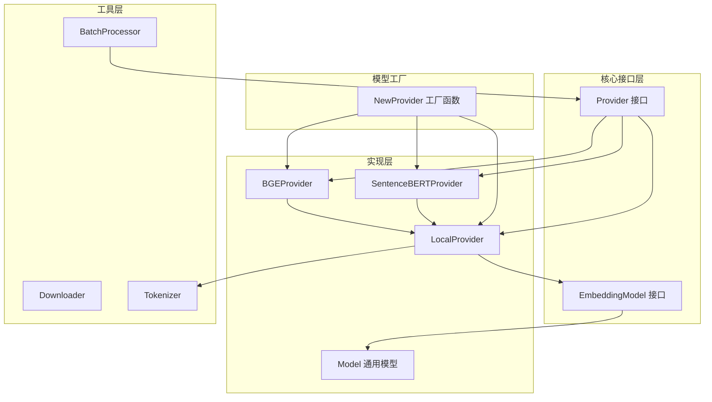
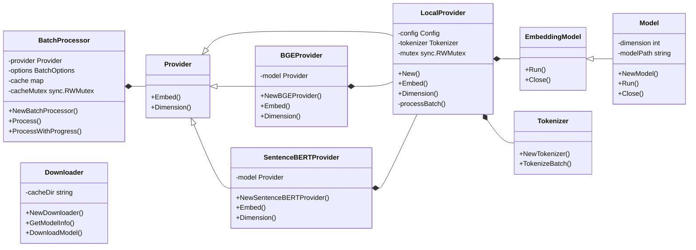

# Embedding 包架构设计

## 架构概述

Embedding 包提供了文本嵌入生成的完整功能，支持本地模型和批量处理。包的设计采用了清晰的层次结构，将不同职责分离到不同的组件中。

## 架构图



## 类关系图



## 核心组件说明

### 1. 核心接口

- **Provider**：定义了嵌入生成的核心接口，所有嵌入提供者都实现此接口
- **EmbeddingModel**：定义了模型推理的接口，处理模型的加载和推理

### 2. 实现类

- **LocalProvider**：本地模型的嵌入提供者，处理分词、批处理和模型调用
- **Model**：通用模型实现，提供基本的模型推理功能
- **BGEProvider**：BGE模型的专用提供者
- **SentenceBERTProvider**：Sentence-BERT模型的专用提供者

### 3. 工具类

- **BatchProcessor**：批量处理嵌入生成，支持并发处理和缓存
- **Downloader**：模型下载器，从远程源下载模型文件
- **Tokenizer**：文本分词器，将文本转换为模型可接受的输入格式

### 4. 工厂函数

- **NewProvider**：根据模型路径创建相应的提供者实例

## 数据流程

1. **输入处理**：文本通过Tokenizer转换为模型输入格式
2. **模型推理**：LocalProvider调用EmbeddingModel执行推理
3. **结果处理**：从模型输出中提取嵌入向量
4. **批处理优化**：BatchProcessor处理批量文本，提供并发和缓存

## 扩展点

- **模型扩展**：可以通过实现EmbeddingModel接口添加新的模型类型
- **提供者扩展**：可以通过实现Provider接口添加新的嵌入提供者
- **批处理优化**：可以扩展BatchProcessor以支持更多优化策略

## 使用示例

```go
// 创建提供者
provider, err := embedding.NewProvider("/path/to/model.onnx")
if err != nil {
    log.Fatal(err)
}

// 生成嵌入
texts := []string{"Hello world", "How are you"}
embeddings, err := provider.Embed(context.Background(), texts)
if err != nil {
    log.Fatal(err)
}

// 使用批处理器
processor := embedding.NewBatchProcessor(provider, embedding.BatchOptions{
    MaxBatchSize:  32,
    MaxConcurrent: 4,
})

// 批量处理
batchEmbeddings, err := processor.Process(context.Background(), largeTextList)
```

## 依赖关系

- **核心依赖**：标准库（context, sync等）
- **测试依赖**：github.com/stretchr/testify

## 性能考虑

- **批处理**：通过批处理减少模型调用次数，提高性能
- **并发处理**：BatchProcessor支持并发处理多个批次
- **缓存**：BatchProcessor内置缓存，避免重复计算
- **资源管理**：EmbeddingModel实现Close方法，确保资源正确释放
