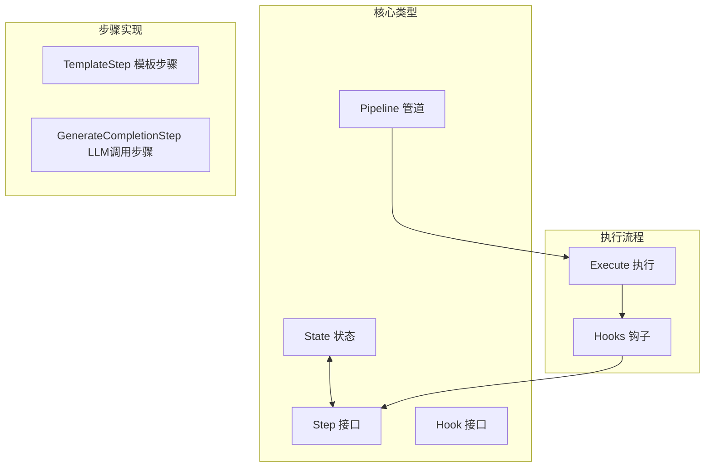
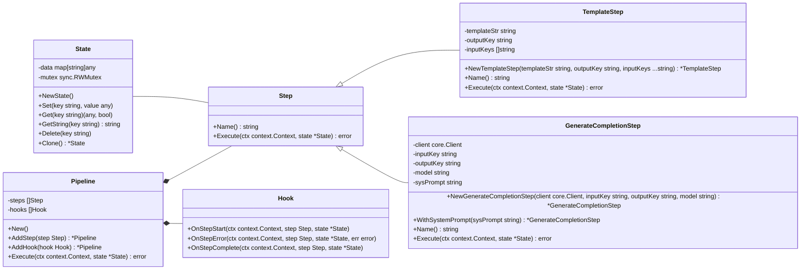

# Pipeline 包架构设计

## 架构概述

Pipeline 包提供了一个灵活的框架，用于组合和执行 LLM 工作流中的操作序列（如 RAG 和数据处理）。包的设计采用了管道模式，将复杂的工作流分解为独立的步骤，并通过状态共享实现步骤间的数据传递。

## 架构图



## 类关系图



## 核心组件说明

### 1. 核心接口

#### Step 接口
- **职责**：定义管道中的单个操作
- **方法**：
  - `Name()`：返回步骤名称，用于日志和调试
  - `Execute(ctx context.Context, state *State) error`：执行步骤操作，从 State 读取数据并写入结果

#### Hook 接口
- **职责**：观察管道执行过程
- **方法**：
  - `OnStepStart()`：步骤开始前调用
  - `OnStepError()`：步骤出错时调用
  - `OnStepComplete()`：步骤成功完成后调用

### 2. 核心结构

#### Pipeline
- **职责**：管理和执行步骤序列
- **特点**：
  - 支持链式调用 `AddStep()` 和 `AddHook()`
  - 顺序执行所有步骤
  - 遇到错误或上下文取消时停止执行
  - 支持钩子观察执行过程

#### State
- **职责**：线程安全的数据容器，用于步骤间数据传递
- **特点**：
  - 线程安全（使用 `sync.RWMutex`）
  - 支持多种类型获取（Get, GetString 等）
  - 支持状态克隆
  - 支持删除操作

### 3. 步骤实现

#### TemplateStep
- **职责**：渲染文本模板
- **功能**：
  - 使用 Go text/template 渲染模板
  - 从 State 读取输入变量
  - 将渲染结果写入 State

#### GenerateCompletionStep
- **职责**：调用 LLM 生成回复
- **功能**：
  - 支持系统提示词
  - 从 State 读取用户输入
  - 将 LLM 回复写入 State
  - 支持灵活的配置选项

## 数据流程

1. **创建管道**：实例化 Pipeline
2. **添加步骤**：使用 `AddStep()` 添加操作步骤
3. **添加钩子**（可选）：使用 `AddHook()` 添加观察者
4. **创建状态**：创建并初始化 State
5. **执行管道**：调用 `Execute()` 运行所有步骤
6. **数据传递**：步骤间通过 State 共享数据

## 使用示例

### 基本使用

```go
// 创建管道
p := pipeline.New()

// 添加步骤
p.AddStep(steps.NewTemplateStep(
    "Hello {{.name}}",
    "greeting",
    "name",
)).AddStep(steps.NewGenerateCompletionStep(
    client,
    "greeting",
    "response",
    "gpt-4",
))

// 创建状态
state := pipeline.NewState()
state.Set("name", "World")

// 执行管道
err := p.Execute(context.Background(), state)

// 获取结果
response, _ := state.GetString("response")
```

### 使用钩子

```go
// 创建日志钩子
logger := &LoggingHook{}

// 添加到管道
p.AddHook(logger)

// LoggingHook 实现
type LoggingHook struct{}

func (h *LoggingHook) OnStepStart(ctx context.Context, step pipeline.Step, state *pipeline.State) {
    fmt.Printf("Starting step: %s\n", step.Name())
}

func (h *LoggingHook) OnStepError(ctx context.Context, step pipeline.Step, state *pipeline.State, err error) {
    fmt.Printf("Step %s failed: %v\n", step.Name(), err)
}

func (h *LoggingHook) OnStepComplete(ctx context.Context, step pipeline.Step, state *pipeline.State) {
    fmt.Printf("Step %s completed\n", step.Name())
}
```

### 链式调用

```go
// 链式调用
result, err := pipeline.New().
    AddStep(steps.NewTemplateStep("{{.input}}", "prompt", "input")).
    AddStep(steps.NewGenerateCompletionStep(client, "prompt", "output", "gpt-4")).
    Execute(ctx, state)
```

## 扩展点

### 添加自定义步骤

```go
// 实现 Step 接口
type CustomStep struct {
    config string
}

func (s *CustomStep) Name() string {
    return "CustomStep"
}

func (s *CustomStep) Execute(ctx context.Context, state *pipeline.State) error {
    // 实现自定义逻辑
    return nil
}

// 使用
p.AddStep(&CustomStep{config: "value"})
```

### 添加自定义钩子

```go
// 实现 Hook 接口
type MetricsHook struct{}

func (h *MetricsHook) OnStepStart(ctx context.Context, step pipeline.Step, state *pipeline.State) {
    // 记录开始时间
}

func (h *MetricsHook) OnStepError(ctx context.Context, step pipeline.Step, state *pipeline.State, err error) {
    // 记录错误
}

func (h *MetricsHook) OnStepComplete(ctx context.Context, step pipeline.Step, state *pipeline.State) {
    // 记录完成时间和指标
}
```

## 依赖关系

- **标准库**：context, sync, bytes, template
- **内部依赖**：github.com/DotNetAge/gochat/pkg/core

## 性能考虑

- **状态管理**：使用读写锁平衡并发性能
- **状态克隆**：浅拷贝避免全量复制开销
- **错误处理**：快速失败策略，避免不必要的计算
- **上下文取消**：支持优雅的任务取消

## 错误处理

- **步骤错误**：返回错误并停止管道执行
- **上下文取消**：检测上下文取消并提前终止
- **钩子错误**：钩子错误不影响主流程执行

## 测试覆盖

核心组件均有对应测试，包括：
- Pipeline 步骤执行和错误处理
- State 线程安全操作
- 各种 Step 实现
